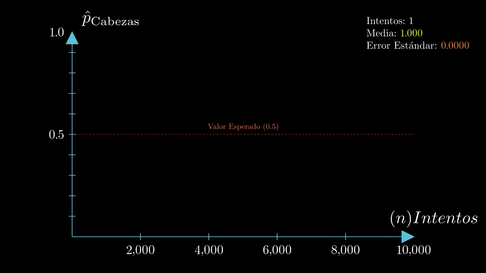

# Repositorio de animaciones hechas para cursos SOL-UC


## Instrucciones
### Para ejecutar cualquiera de las animaciones, debes escrbir en consola:
```shell
manim {nombre_archivo}.py {nombre_clase} 
```

### Por ejemplo, para visualizar la animación de LGN, debes escribir en consola:
```shell
manim lln.py LLN
```

## Previews
### LGN

